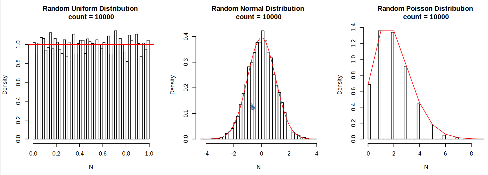

# Random

Random is a C++ class implementing the zufall random generator functions
by W. P. Petersen[1].




## Classes in this Package

Two classes are provided in namespace `teh::zufall`.
Class **Random** contains zufall random number generators
for uniform, normal, and Poisson distributions.
Class **RandomSeed** manages a random seed in proper range for class **Random**.

Here is a brief summary of these classes:

```
RandomSeed (
  unsigned int const entropy,   // An entropy value; default is std::time(NULL)
  unsigned int const minSeed,   // Minimum allowed seed > zero
  unsigned int const maxSeed)   // Maximum allowed seed; < (max(unsigned int) - 144)

RandomSeed::Get()               // Get the seed.
RandomSeed::GetRange()          // Get the valid seed range.
RandomSeed::GetUpperLimit()     // Get the maximum seed value + 1 for the zufall algorithms.

Random ( unsigned int const seed )

// Each generator function has 2 forms:
// 1) generate a vector of values
// 2) generate a single value

void Random::Uniform ( unsigned int const n, std::vector<double> & u )
unsigned int Random::Uniform ()

void Random::Normal ( unsigned int const n, std::vector<double> & g )
unsigned int Random::Normal ()

void Random::Poisson ( unsigned int const n, double const mu, std::vector<unsigned int> & q )
unsigned int Random::Poisson ( double const mu )
```

## Using class Random

```
// Initialize the seed and random number generator:
RandomSeed seedGen;
Random rng( seedGen.Get() );
std::size_t const numValues = 10000;

// Uniform random values
std::vector<double> u;
rng.Uniform( sizeSet, u );

// Gaussian normal random values
std::vector<double> g;
rng.Normal( sizeSet, g );

// Poisson random values
std::vector<unsigned int> p;
double const mu = 2.0;
rng.Poisson( sizeSet, mu, p );
```

## The zufall functions

W. P. Petersen released the zufall package in 1994 as a set of
Fortran77 functions[1]. The package was made available in the 
netlib repository, currently at
[http://www.netlib.org/random/zufall.f](/uri "www.netlib.org/random/zufall.f")

## License

No license terms are explicitly stated in the original zufall code 
provided in the netlib repository.

This C++ implementation of zufall, including all classes and other code
in `namespace teh`, as well as other code files and documetation in this package,
are provided under the Apache 2.0 license, 
whose full text and terms are in the accompanying file 
[LICENSE.md](LICENSE.md.)


## Citations

1. Petersen, W. P., 1994.
   Lagged Fibonacci Series Random Number Generators for the NEC SX-3.
   International Journal of High Speed Computing;
   vol. 06, no. 03, pp. 387-398.
